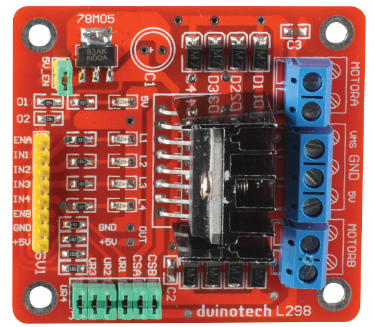
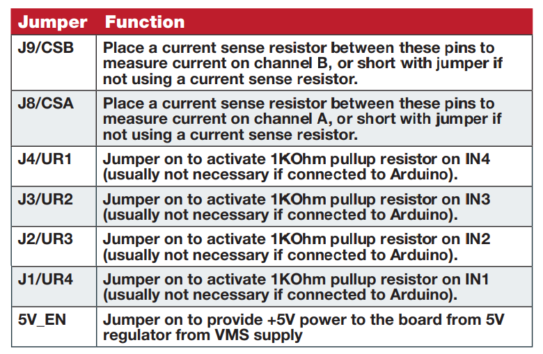

# Motor controllers




## Motor Controller




### Right side (blue side)

Motor controller | Where it goes 
-- | --
GND | Both your Arduino GND <br>external power supply GND
5v  | Arduino 5v  
VMS | External Power Supply Vcc
MOTOR_A top| either red or black on motor a
MOTOR_A bottom | the other on motor a
MOTOR_B top | either red or black on motor b
MOTOR_B bottom | the other on motor b

### Left side (yellow side)

Motor controller | Where it goes 
-- | --
ENA | enableA pin (or 5v arduino)
in1 | en1 pin
in2 | en2 pin 
in3 | en3 pin
in4 | en4 pin
enb | enableB pin (or 5v arduino)
GND | gnd arduino
5v  | 5v arduino

```cpp

#define upButtonPin 5
#define downButtonPin 4
#define leftButtonPin 3
#define rightButtonPin 2

#define enableA 11
#define in1 9
#define in2 8


int speed;
bool up;
bool down; 
bool left;
bool right;

void driveForwards(int enable, int speed, int leftA, int leftB){
  analogWrite(enable, speed);
  digitalWrite(leftA, HIGH);
  digitalWrite(leftB, LOW);
}

void driveBackwards(int enable, int speed, int leftA, int leftB){
  analogWrite(enable, speed);
  digitalWrite(leftA, LOW);
  digitalWrite(leftB, HIGH);
}

void stop(int enable){
  analogWrite(enable, 0);

}

void setup(){
  Serial.begin(9600);
  Serial.println("setting up pinModes");
  pinMode(in1, OUTPUT);
  pinMode(in2, OUTPUT);
  for (int i = 2; i <= 5 ;i++){
    pinMode(i, INPUT_PULLUP);
  }
  speed = 255;
  analogWrite(enableA, speed);
  Serial.println("setup complete");
}

void loop(){
  up = !digitalRead(upButtonPin);
  down = !digitalRead(downButtonPin);
  left = !digitalRead(leftButtonPin);
  right = !digitalRead(rightButtonPin);
  
  Serial.println(String(up) + " " + String(down) + " " + String(left) + " " + String(right));
  
  if (up) {
    driveForwards(enableA, speed, in1, in2);
  } else if (down) {
    driveBackwards(enableA, speed, in1, in2);
  } else {
    stop(enableA);
  }
  
  /**
  if (left) {
    driveForwards(in1, in2);
  } else if (up) {
    driveForwards(in1, in2);
  }
  **/
}

```