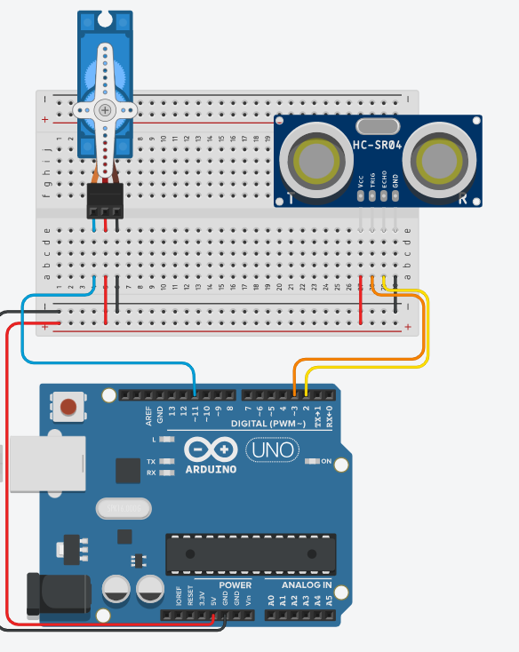

# Servos + distance



```cpp
#include <Servo.h>

Servo myservo; 

int trig = 3;
int echo = 2;
int sig;

void setup()
{
  Serial.begin(9600);
  myservo.attach(11);  
}

unsigned long ping(int trig, int echo)
{
  pinMode(trig, OUTPUT);
  pinMode(echo, INPUT);
  digitalWrite(trig, LOW);
  delayMicroseconds(2);
  
  // Send a 10 microsecond pulse
  digitalWrite(trig, HIGH);
  delayMicroseconds(10);
  digitalWrite(trig, LOW);

  // Read the echo time in microseconds
  long duration = pulseIn(echo, HIGH);

  // Convert to centimeters: distance = duration * 0.034 / 2
  long distance = duration * 0.034 / 2;
  return distance;
}

void loop() {
    //
}

```