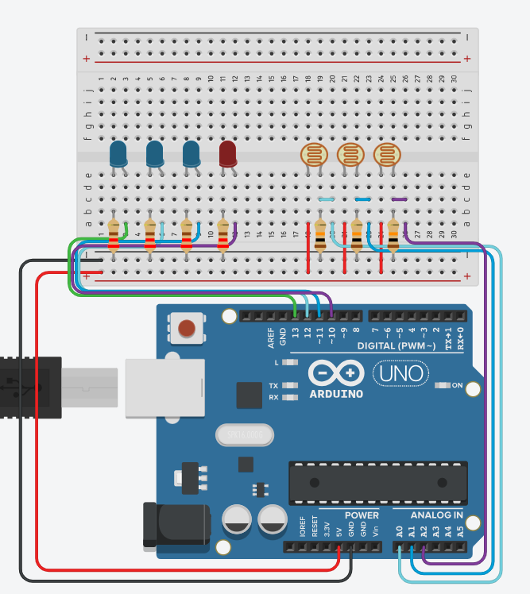

# Build line trackers 

- Line tracker 
- 4x LEDs
- 4x 220r - 1000r resistors
- 9x male:male jump leads



NOTE: the 3 photoresistors are the best I can do for tinkercad. You will something similar for the line trackers. 

```cpp
const int TURN_LEFT = 0;
const int TURN_RIGHT = 1;
const int DRIVE_STRAIGHT = 2;
const int DRIVE_REVERSE = 3;

const int leftLineSensor = A0;
const int centreLineSensor = A1;
const int rightLineSensor = A2;

const int leftLED = 13;
const int centerLED = 12;
const int rightLED = 11;
const int reverseLED = 10;

const int THRESHOLD = 500;


int leftLineVal;
int rightLineVal;
int centerLineVal;

int CURRENT_STATE = DRIVE_STRAIGHT;


void setup()
{
  Serial.begin(9600);
  Serial.println("Begining setup and configuration");
  for (int i = reverseLED; i<=leftLED; i++){
    pinMode(i, OUTPUT);
  }
  
  Serial.println("Setup complete");
}

void loop()
{
  leftLineVal = analogRead(leftLineSensor);
  centerLineVal = analogRead(centreLineSensor);
  rightLineVal = analogRead(rightLineSensor);
  Serial.println(String(CURRENT_STATE) + " " + String(leftLineVal) + " " + String(centerLineVal) + " " + String(rightLineVal));

}
```