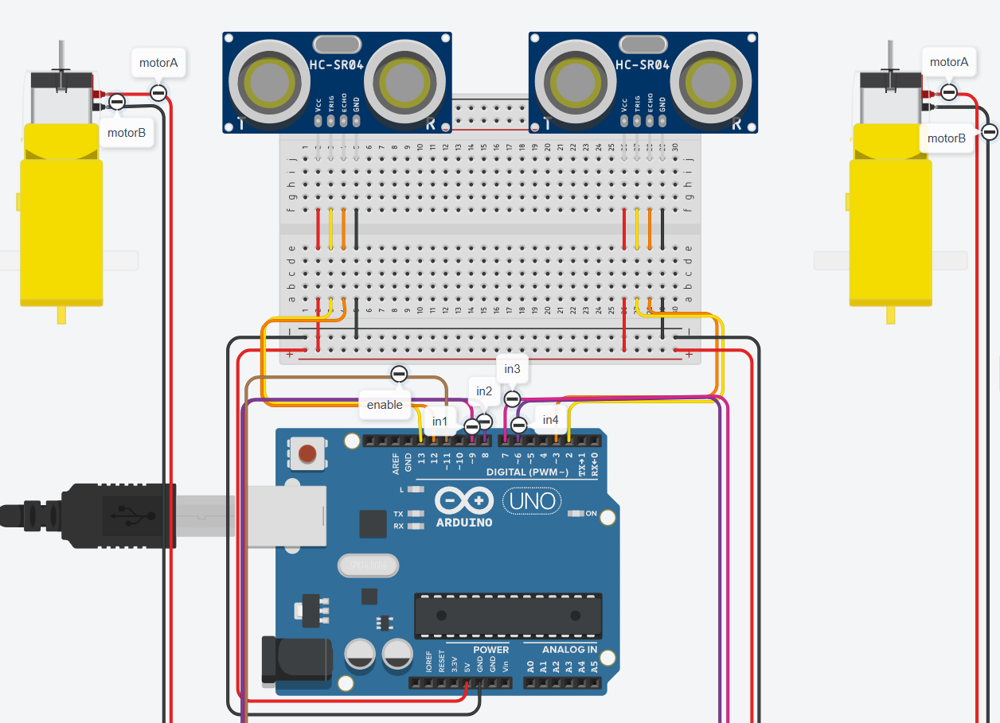
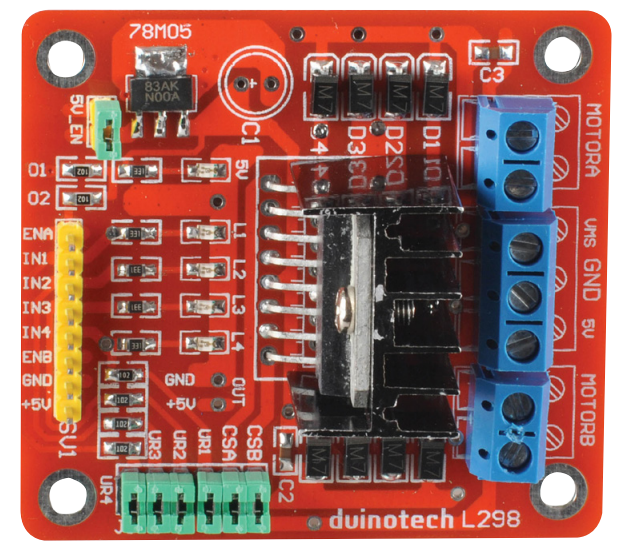

# Car

Requirements: 

1x 6v (black) battery
1x L298n motor controller
2x HR-SR04 ultrasonic distance sensors
2x yellow motors

8x M-F jump leads
8x M-M jump leads






## Motor Controller

### Right side (blue side)

Motor controller | Where it goes 
-- | --
GND | Both your Arduino GND <br>external power supply GND
5v  | Arduino 5v  
VMS | External Power Supply Vcc
MOTOR_A top| either red or black on motor a
MOTOR_A bottom | the other on motor a
MOTOR_B top | either red or black on motor b
MOTOR_B bottom | the other on motor b

### Left side (yellow side)

Motor controller | Where it goes 
-- | --
ENA | enableA pin (or 5v arduino)
in1 | en1 pin
in2 | en2 pin 
in3 | en3 pin
in4 | en4 pin
enb | enableB pin (or 5v arduino)
GND | gnd arduino
5v  | 5v arduino


```cpp
#define leftTrig 13
#define leftEcho 12
#define rightTrig 2
#define rightEcho 3
#define enable 11
#define in1 9
#define in2 8
#define in3 7
#define in4 6

#define threshold 5

int const potIn = A3;
unsigned long leftDist;
unsigned long rightDist;
int diff;
int speed;

unsigned long ping(int trig, int echo){
  pinMode(trig, OUTPUT);
  pinMode(echo, INPUT);
  digitalWrite(trig, LOW);
  delayMicroseconds(2);
  
  // Send a 10 microsecond pulse
  digitalWrite(trig, HIGH);
  delayMicroseconds(10);
  digitalWrite(trig, LOW);

  // Read the echo time in microseconds
  long duration = pulseIn(echo, HIGH);

  // Convert to centimeters: distance = duration * 0.034 / 2
  long distance = duration * 0.034 / 2;
  return distance;
}

void forward(int leftA, int leftB, int rightA, int rightB){
  digitalWrite(leftA, HIGH);
  digitalWrite(leftB, LOW);
  digitalWrite(rightA, LOW); 
  digitalWrite(rightB, HIGH);
}

void left(int leftA, int leftB, int rightA, int rightB){
  digitalWrite(leftA, LOW);
  digitalWrite(leftB, HIGH);
  digitalWrite(rightA, LOW); 
  digitalWrite(rightB, HIGH);
}

void right(int leftA, int leftB, int rightA, int rightB){
  digitalWrite(leftA, HIGH);
  digitalWrite(leftB, LOW);
  digitalWrite(rightA, HIGH); 
  digitalWrite(rightB, LOW);
}

void reverse(int leftA, int leftB, int rightA, int rightB){
  digitalWrite(leftA, LOW);
  digitalWrite(leftB, HIGH);
  digitalWrite(rightA, HIGH); 
  digitalWrite(rightB, LOW);
}


void setup(){
  Serial.begin(9600);
  Serial.println("setting up pinModes");
  //pinMode(A0, OUTPUT);
  pinMode(in1, OUTPUT);
  pinMode(in2, OUTPUT);
  pinMode(in3, OUTPUT);
  pinMode(in4, OUTPUT);
  pinMode(enable, OUTPUT);
  speed = 255;
  Serial.println("setup complete");
}

void loop(){
  leftDist = ping(leftTrig, leftEcho);
  rightDist = ping(rightTrig, rightEcho);
  
  // Calculate left or right or straight
  diff = leftDist - rightDist;
  if (abs(diff) <= threshold) {
    Serial.print("Drive Straight ");
  } else if (diff > threshold) {
    Serial.print("Turn left ");
  } else {
    Serial.print("Turn right ");
  }
  
  // calculate how fast we are going
  
  analogWrite(enable, speed);
  Serial.println(speed);
  
  // drive about
  forward(in1, in2, in3, in4);
  delay(500);
  left(in1, in2, in3, in4);
  delay(500);
  right(in1, in2, in3, in4);
  delay(500);
  reverse(in1, in2, in3, in4);
  delay(500);
  
  
  
  
}
```