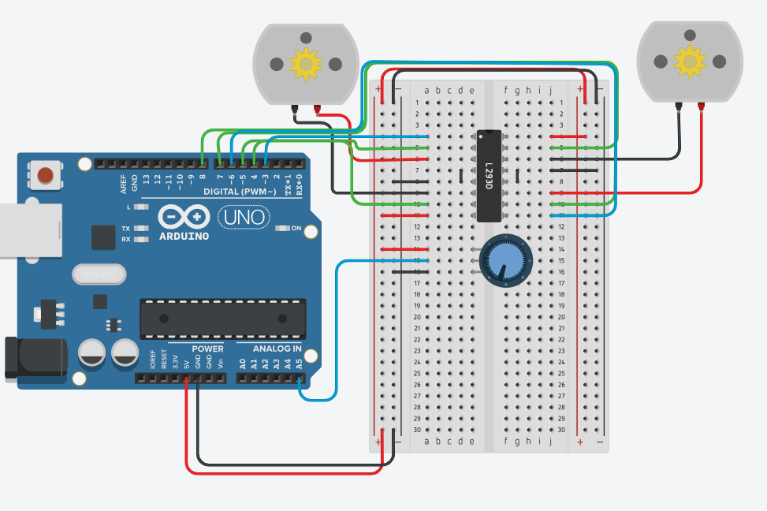

# h-bridge controllers

## Learning Intentions 

- Using a H-Bridge controller create a system that controls two motors independently.

## Success Criteria 

At the end of this session you will be able to: 

- control a motor to move forwards and backward
- control a second motor independently of the first 
- use a potentiometer to control speed 

## Parts 

- 1x breadboard
- 1x potentiometer
- 2x motors
- 1x arduino
- 1x L293D h-bridge controller
- 22-ish-x wires


## End circuit 



## Tutorial

#### Code

```cpp
int motorA = 2;
int motorB = 3;
int motorD = 4;
int motorE = 5;


void setup()
{
  pinMode(motorA, OUTPUT);
  pinMode(motorB, OUTPUT);
  pinMode(motorD, OUTPUT);
  pinMode(motorE, OUTPUT);
  Serial.begin(9600);
}

void loop()
{
  Serial.println("forwards");
  digitalWrite(motorA, LOW);
  digitalWrite(motorB, HIGH);
  
  digitalWrite(motorD, HIGH);
  digitalWrite(motorE, LOW);
  
  delay(5000);
  Serial.println("turn left");
  
  digitalWrite(motorA, LOW);
  digitalWrite(motorB, HIGH);
  
  digitalWrite(motorD, LOW);
  digitalWrite(motorE, HIGH);
  delay(5000);
  
}
```