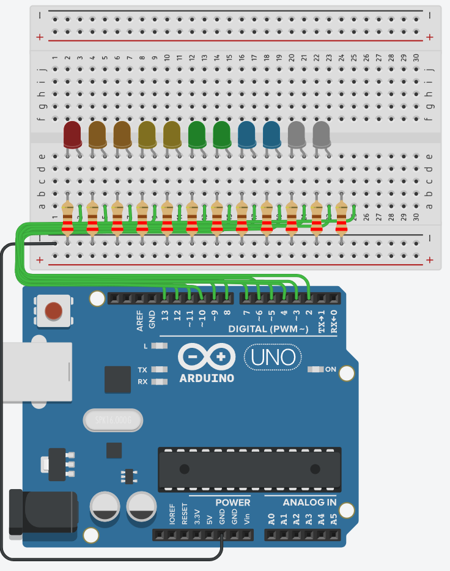

# **Finite State Machines in Arduino**

## **Objective:**

By the end of this lecture, you will understand what a Finite State Machine (FSM) is, how it works, and how to implement it in Arduino C to control sequential operations effectively.

---

## **1. What is a Finite State Machine (FSM)?**

### **Definition:**

A **Finite State Machine (FSM)** is a computational model used to design systems that transition between a limited number of defined states based on inputs or conditions.

### **Key Concepts:**

- **States**: Defined conditions that the system can be in.
- **Transitions**: Rules that dictate when and how the system moves between states.
- **Events/Inputs**: External factors that trigger state changes.
- **Actions**: Tasks performed when entering, exiting, or staying in a state.

### **Real-World Examples of FSMs:**

- Traffic light systems (Red → Green → Yellow → Red).
- Elevator control (Idle → Moving Up → Stopped → Moving Down).
- Arduino LED chaser (LEFT_TO_RIGHT → RIGHT_TO_LEFT).

---

## **2. Using FSMs in Arduino**

### **Step 1: Define the States Using Constants**

FSMs can be implemented using `const int` to define states.

```c
const int LEFT_TO_RIGHT = 0;
const int RIGHT_TO_LEFT = 1;
```

This defines two states: `LEFT_TO_RIGHT` and `RIGHT_TO_LEFT`.

### **Step 2: Declare a State Variable**

Create a variable to track the current state:

```c
int currentDirection = LEFT_TO_RIGHT;
```

### **Step 3: Implement State Transitions**

Define logic to change states based on conditions.

```c
if (currentDirection == LEFT_TO_RIGHT) {
    currentDirection = RIGHT_TO_LEFT;
} else {
    currentDirection = LEFT_TO_RIGHT;
}
```

---

## **3. Example: Implementing FSM for LED Strobing**



```c
// Define LEDs range
const int LOW_LED = 2;
const int HIGH_LED = 13;

// Define state directions
const int LEFT_TO_RIGHT = 0;
const int RIGHT_TO_LEFT = 1;

// Variables
int delayTime = 200;
int currentDirection = LEFT_TO_RIGHT;
String lastMessage;

void setup() {
    Serial.begin(9600);
    for (int i = LOW_LED; i <= HIGH_LED; i++) {
        pinMode(i, OUTPUT);
    }
    lastMessage = "LEFT_TO_RIGHT";
}

void loop() {
    if (currentDirection == LEFT_TO_RIGHT) {
        for (int i = LOW_LED; i <= HIGH_LED; i++) {
            digitalWrite(i, HIGH);
            delay(delayTime);
            digitalWrite(i, LOW);
        }
        currentDirection = RIGHT_TO_LEFT;
    } else {
        for (int i = HIGH_LED; i >= LOW_LED; i--) {
            digitalWrite(i, HIGH);
            delay(delayTime);
            digitalWrite(i, LOW);
        }
        currentDirection = LEFT_TO_RIGHT;
    }
}
```

---

## **4. Exercise for Students**

- **Question:** How can we refactor the loop’s LED strobing logic into separate functions for readability and modularity?
- **Task:** Modify the example above by extracting the strobing logic into functions called `strobeLeftToRight()` and `strobeRightToLeft()`, then call them in `loop()` instead.

---

## **5. Explanation of the Code**

1. **State Definition:** The FSM defines two states (`LEFT_TO_RIGHT` and `RIGHT_TO_LEFT`).
2. **Transition Logic:** The loop determines which strobing pattern to execute based on `currentDirection`.
3. **Loop Execution:** The system continuously switches between states, controlling LED behaviour.
4. **Serial Communication (Optional):** `lastMessage` can be modified through serial input to change direction dynamically.

---

## **6. Benefits of Using FSMs in Arduino**

- **Code Organization:** Makes complex logic manageable.
- **Scalability:** Easily extendable by adding more states.
- **Efficiency:** Reduces redundant operations by structuring state-based execution.

---

## **Summary**

- A Finite State Machine (FSM) manages system behaviour through defined states and transitions.
- In Arduino, `const int` can be used to define states, and a variable tracks the current state.
- FSMs are widely used in real-world applications, such as LED control, traffic lights, and automation.
- Extracting logic into functions makes FSM code more modular and maintainable.

By mastering FSMs, you can write more efficient and structured Arduino programs!
