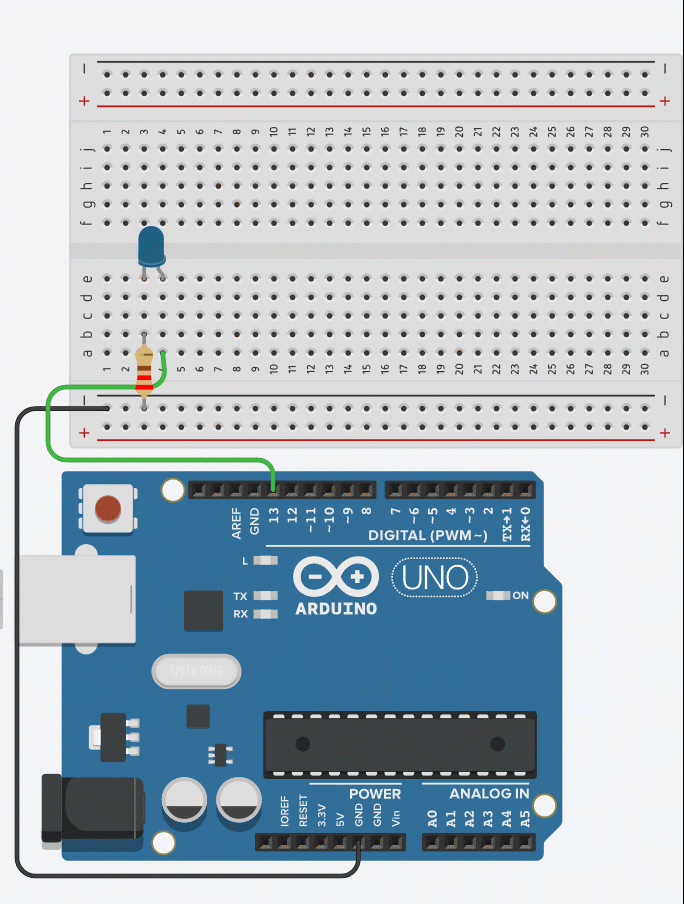
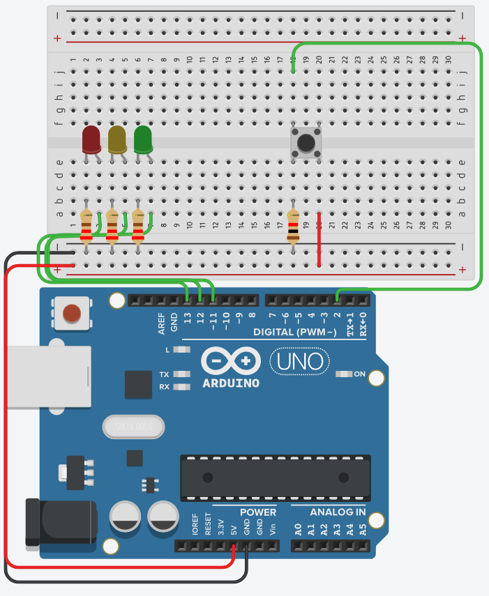
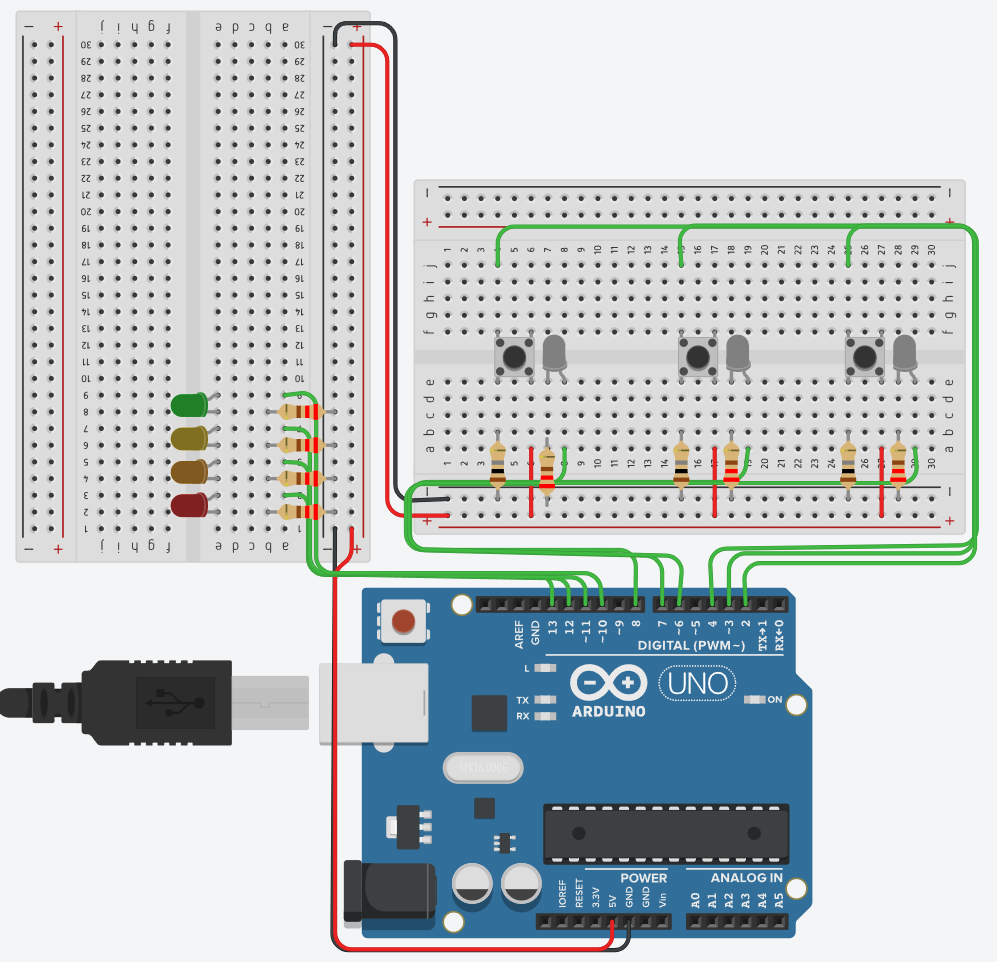

# Practice questions

## 1. Simple LED Blinking Modes (Basic FSM)

Objective: Learn to switch between predefined LED blinking modes using an FSM.

Problem Statement:
Write an Arduino program that cycles through three different LED blinking patterns automatically using an FSM. Each pattern should last for 3 seconds before transitioning to the next state.

- State 1 (SLOW BLINK): LED blinks every 1 second.
- State 2 (FAST BLINK): LED blinks every 200ms.
- State 3 (SOLID ON): LED stays continuously on.

The system should loop back to State 1 after State 3.



```cpp

int const int SLOW = 1000;
int const int FAST = 200;
int const int SOLID = 0;


int const int CURRENT_SPEED = SLOW;

int const int WAIT_TIME = 3000;
int LED = 13;
unsigned long endTime;
unsigned long startTime;

void setup()
{
  Serial.begin(9600);
  pinMode(LED, OUTPUT);
}

void loop() {
    // your code goes here
}

```

## 2. Simulated Traffic Light with FSM

Objective: Use an FSM to control a simple traffic light sequence.

Problem Statement:
Write an Arduino program that simulates a traffic light system using an FSM. The states should transition automatically as follows:

- State 1: RED (5 seconds)
- State 2: GREEN (5 seconds)
- State 3: YELLOW (2 seconds)
- Loop back to RED.



## 3. Line Tracking & Distance Sensing (Decision-Based FSM)

Objective: Implement state-based decisions using two line sensors and an ultrasonic distance sensor.

Problem Statement:
Write an FSM-based program to control a line-following robot with distance sensing. The robot has two buttons that represent line sensors (Left and Right) and an ultrasonic distance sensor.

- State 1: Moving Forward → Default state.
- State 2: Left Turn → If the left sensor detects a line, turn left.
- State 3: Right Turn → If the right sensor detects a line, turn right.
- State 4: Stop → If an obstacle is detected within 10cm, stop.


```cpp


unsigned long ping(int trigPin, int echoPin){
  long duration;
  digitalWrite(trigPin, LOW);
  delayMicroseconds(2);
  digitalWrite(trigPin, HIGH);
  delayMicroseconds(10);
  digitalWrite(trigPin, LOW);
  duration = pulseIn(echoPin, HIGH);
  return duration * 0.034 / 2; 
}

void setup() {
    // ...
}

void loop() {
    // ...
}

```

## 4. Elevator Control System (Complex FSM)

Objective: Use an FSM to control an elevator system with multiple inputs.

Problem Statement:
Write an Arduino program to simulate an elevator with 3 floors, controlled by buttons.

- State 1: Idle → The elevator waits for a button press.
- State 2: Moving Up → The elevator moves up if the requested floor is higher.
- State 3: Moving Down → The elevator moves down if the requested floor is lower.
- State 4: Arrived → The elevator stops at the destination.

Expected Behaviour:

Rules:

- The elevator moves only if a button is pressed.
- It takes 1 second per floor transited
- When it arrives at the door it turns on the corresponding white LED for 1 second.
- When it leaves it turns that white LED off and sets it's state to IDLE
- Pressing another button during movement updates the target floor.
- GREEN: ARRIVED
- YELLOW: MOVING UP
- ORANGE: MOVING DOWN
- RED: IDLE



```cpp
const int NO_BUTTON = 0;
const int FIRST = 2;
const int SECOND = 3;
const int THIRD = 4;


const int ACTIVE = 10;
const int UPWARDS = 11;
const int DOWNWARDS = 12;
const int IDLE = 13;


const int NO_FLOOR = 5;
const int ONE = 6;
const int TWO = 7;
const int THREE = 8;


int CURRENT_LIFT_STATE = IDLE;
int CURRENT_BUTTON = NO_BUTTON;
int CURRENT_FLOOR = NO_FLOOR;

void setup()
{
  Serial.begin(9600);
  for (int i = IDLE; i<= ACTIVE; i++){
    pinMode(i, OUTPUT);
  }
  for (int i = ONE; i<=THREE; i++){
    pinMode(i, OUTPUT);
  }
  
  for (int i = FIRST; i<= THIRD; i++){
    pinMode(i, INPUT);
  }
}

int checkButtons(){
  int out = NO_BUTTON;
  for (int i = FIRST; i<=4; i++){
    if (digitalRead(i)) out = i;
  }
  return out;
}

void loop()
{
  Serial.println(checkButtons());
}
```
