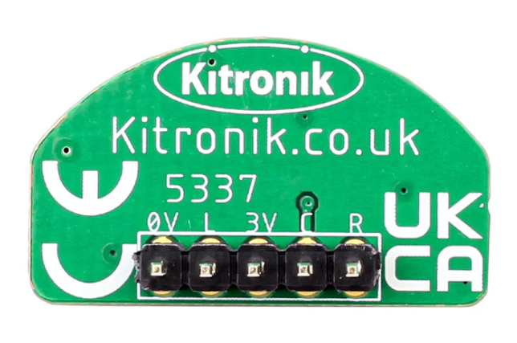
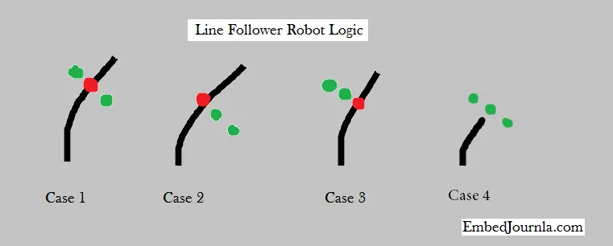

**Tutorial: Using a Line Tracking Sensor with Arduino (Explicit Direct Instruction)**

### Objective:
You will learn how to connect a line tracking sensor to an Arduino and use `analogRead()` to detect line positions. We will power the sensor with 3.3V to prevent damage and ensure stable readings.

---

##  What You Need
- Arduino board 
- Line tracking sensor 
- Breadboard and jumper wires
- A white surface and something black
- USB cable 



---

## 3.3V not 5v
> The line tracking sensor works best with 3.3V. 
> Always double-check the sensor datasheet. If it lists a 3.3V input, use the **3.3V output pin** on your Arduino.

**Locate the 3.3V pin on your Arduino**:
- On most Arduino boards, the 3.3V pin is marked next to the 5V and GND pins.

---

##  Wiring the Sensor
1. Connect **GND (0V)** on the sensor to **GND** on the Arduino.
2. Connect **L** (Left) pin on the sensor to **A0** on the Arduino.
3. Connect **3V** on the sensor to the **3.3V pin** on the Arduino.
4. Connect **C** (Center) pin on the sensor to **A1** on the Arduino.
5. Connect **R** (Right) pin on the sensor to **A2** on the Arduino.

Double-check all your connections before powering on.

---

## Understanding Sensor Output
- Each analog pin (A0, A1, A2) will read a value between 0 and 1023.
- **Higher values** indicate the sensor sees a white or light surface.
- **Lower values** indicate the sensor sees a black line.

---

##  Arduino Code Example
```cpp
void setup() {
  Serial.begin(9600);
}

void loop() {
  int leftValue = analogRead(A0);
  int centerValue = analogRead(A1);
  int rightValue = analogRead(A2);

  Serial.print("Left: ");
  Serial.print(leftValue);
  Serial.print("  Center: ");
  Serial.print(centerValue);
  Serial.print("  Right: ");
  Serial.println(rightValue);

  delay(200);
}
```

Upload the code to your Arduino.

---

## Testing
- Place the sensor on the white surface.
- Move it so that the black line passes under each sensor.
- Watch the serial monitor.
- You should see lower values when the line is under each sensor.


---

## Next Steps
- Experiment by moving faster or slower.
- Try using `if` statements to light up LEDs based on sensor readings.
- Start thinking about how this could control a line-following robot!

---


## FSM implementation 

Using FSM lets make a an implementation of a line tracker using the sensor. 

- grab 3 LEDs and 3 resistors. 
- LEDs represents which way we should turn




```cpp
const int TURN_LEFT = 1;
const int TURN_RIGHT = 2;
const int DRIVE_STRAIGHT = 3;

int CURRENT_STATE = DRIVE_STRAIGHT;

int leftValue ;
int centerValue;
int rightValue;

void setup() {
  Serial.begin(9600);
}

int driveStraight(int leftValue, int centerValue, int rightValue){
    if (leftValue > 500) return TURN_RIGHT;

    // logic

    return DRIVE_STRAIGHT;
}

void loop() {
  leftValue = analogRead(A0);
  centerValue = analogRead(A1);
  rightValue = analogRead(A2);

  if (CURRENT_STATE == DRIVE_STRAIGHT){
    CURRENT_STATE = driveStraight(leftValue, centerValue, rightValue);
  }
}
```


