# Fedora server

Press the`windows` button and type `virt-manager`

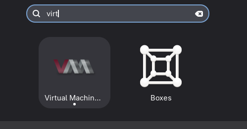

Create a new virtual machine

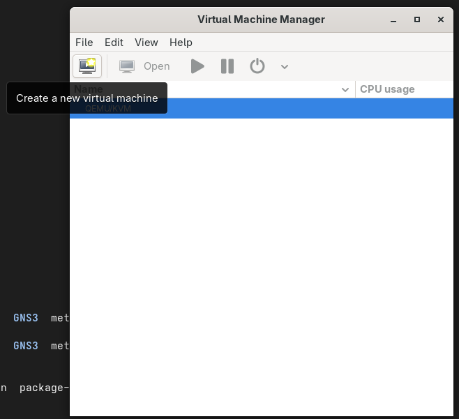

Local install media 

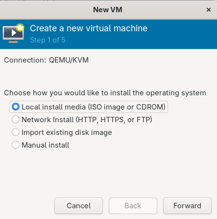

Click browse

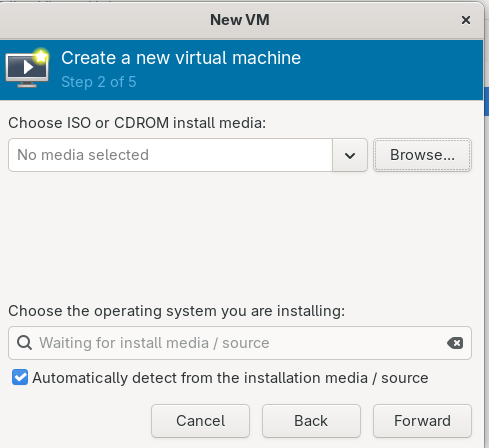

Browse local

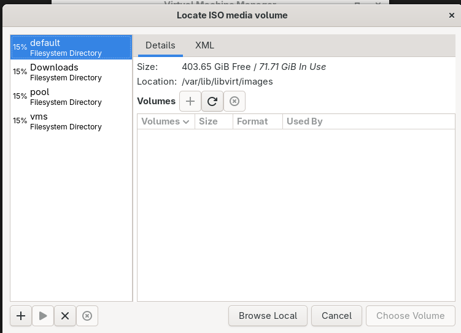


Go to the root directory and then into the `/Downloads` directory (not your home downloads directory, the root Downloads) then go Forwards

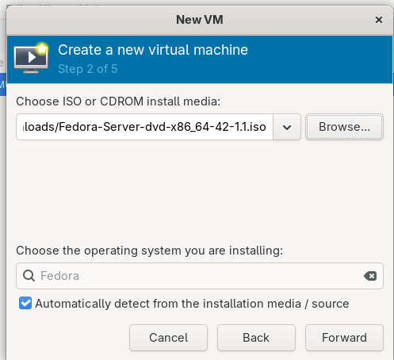

Year 11s choose 4GB of ram

Year 12s should choose 12 GB of ram

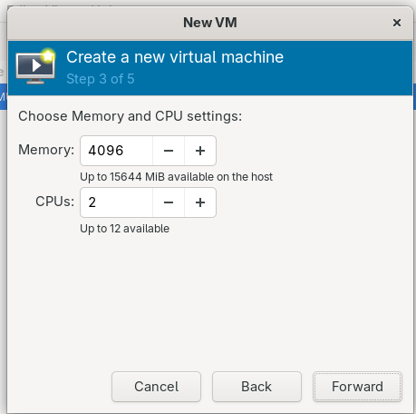

20GB should be fine

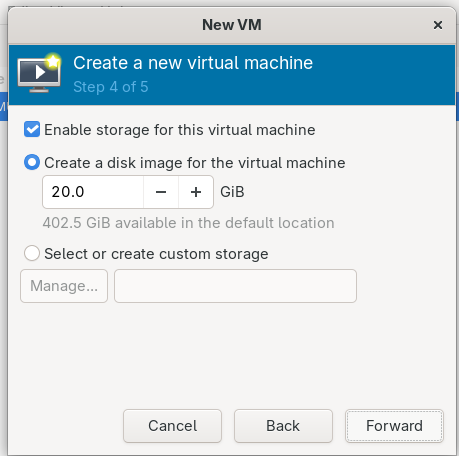

Give it a name that we can identify as a student 

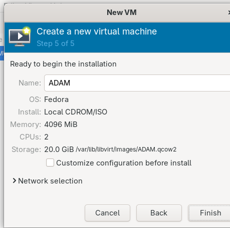

Choose the top install

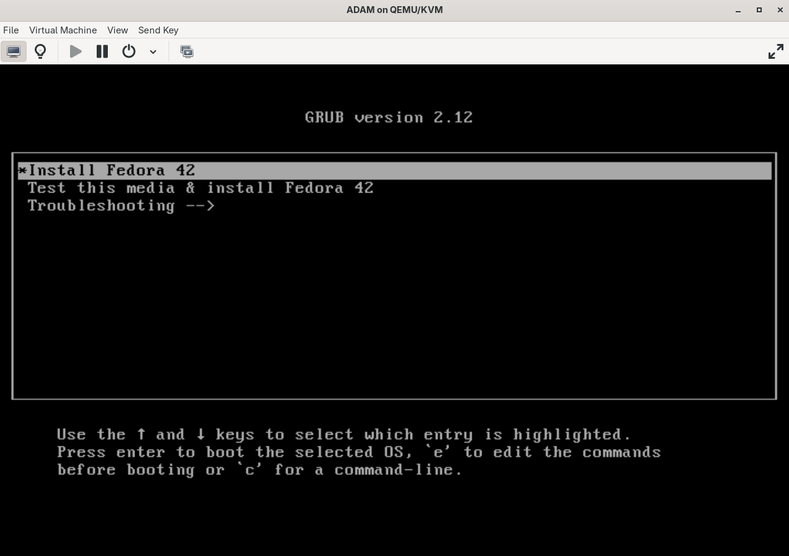

I don't care what language you pick. Just be aware I can only read English

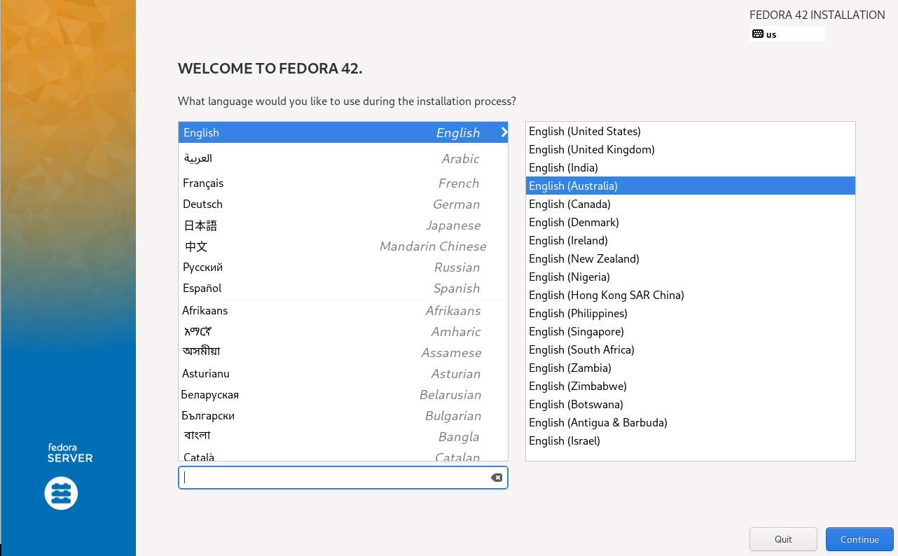

We need to click into both the installation and the user creation

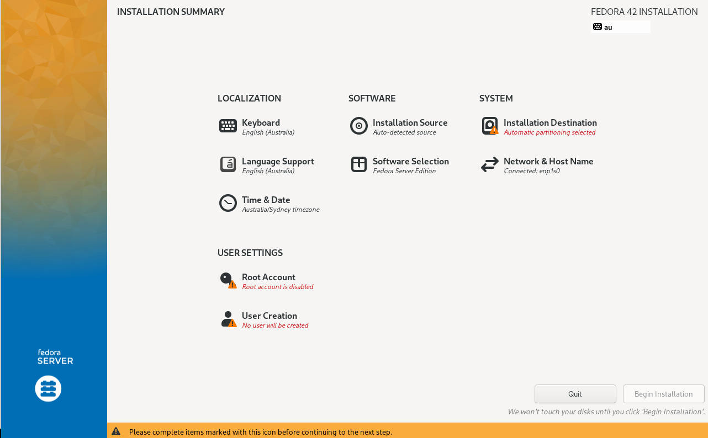

We just need to agree to use the default values. We will explore more advance settings later. 

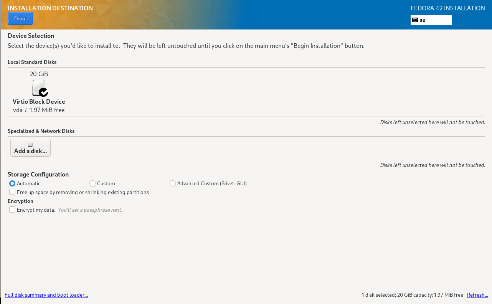

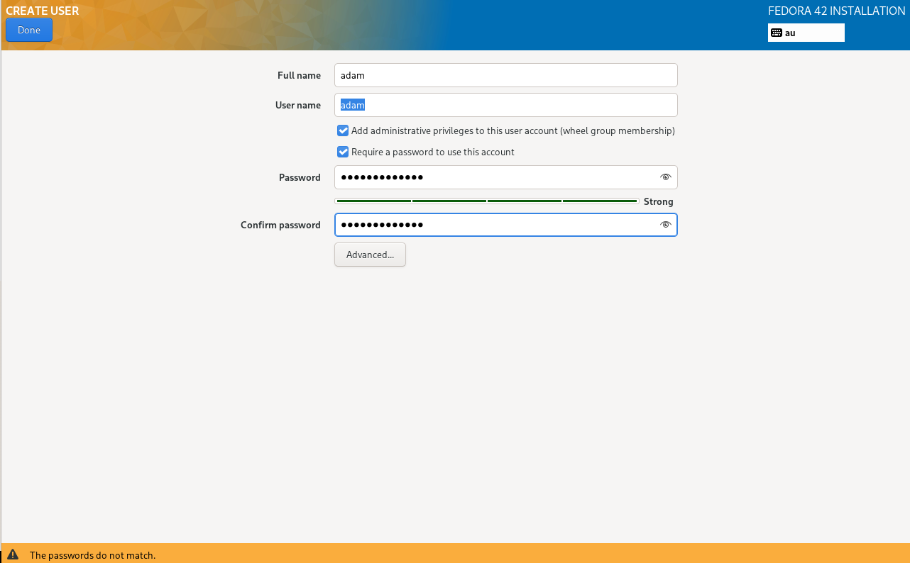

Go into user creation and give yourself a username and password. Then done -> begin installation. 

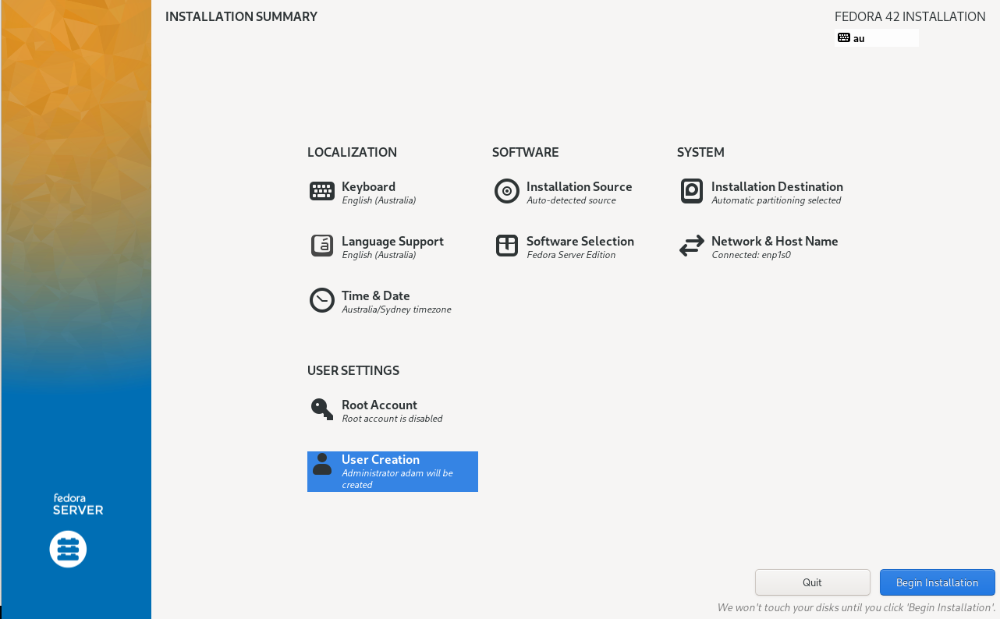

Chillax

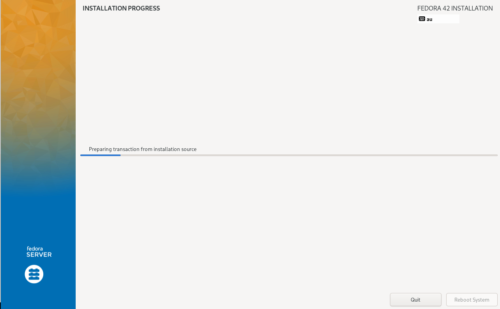

Reboot machine

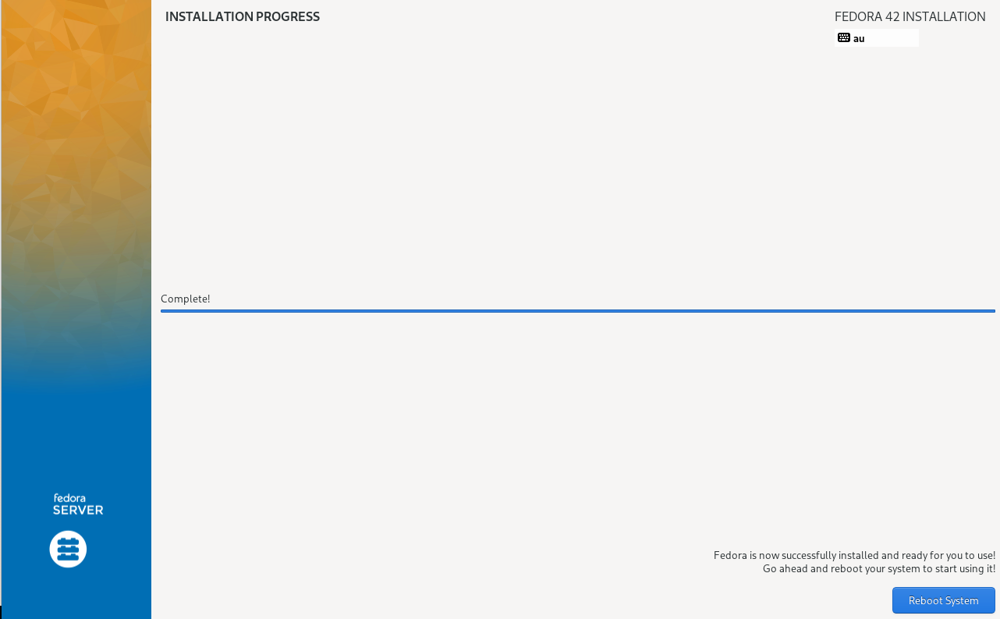

Login: 

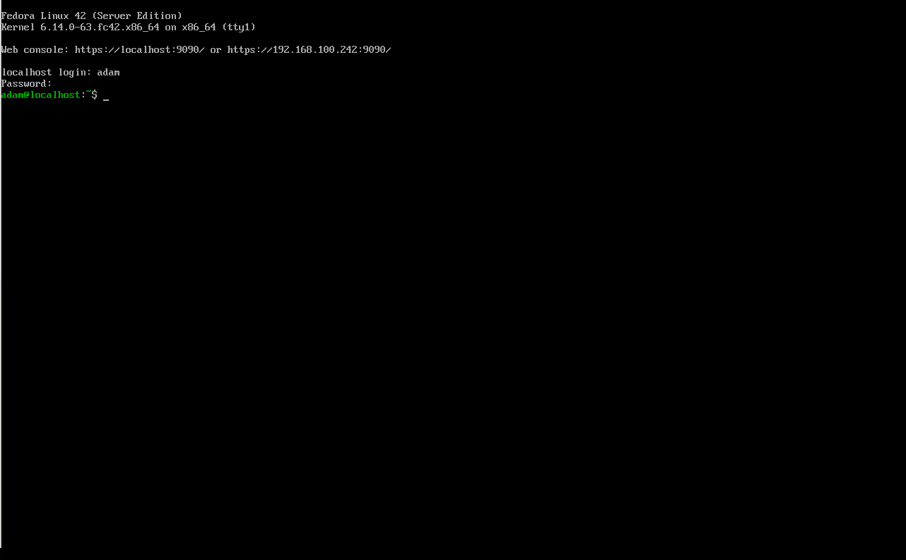

```bash
adam@localhost:~$ whoami
adam
adam@localhost:~$  
```


```bash
adam@localhost:~$ sudo whoami

We trust you have received the usual lecture from the local System
Administrator. It usually boils down to these three things:

    #1) Respect the privacy of others.
    #2) Think before you type.
    #3) With great power comes great responsibility.

For security reasons, the password you type will not be visible.

[sudo] password for adam: 
root
adam@localhost:~$ 

```

```bash
sudo dnf update
```

It's going to take a bit, and it will probably ask you yes no questions say yes. 


```bash
sudo dnf install nano
```

```bash
sudo systemctl status sshd
```

```bash
sudo nano /etc/ssh/sshd_config
```

press `control + w` and search for `PasswordA`

Remove the `#`

Press `control + s` and then `control + x`

```bash
sudo systemctl restart sshd
```

```bash
adam@localhost:~$ ip a
1: lo: <LOOPBACK,UP,LOWER_UP> mtu 65536 qdisc noqueue state UNKNOWN group default qlen 1000
    link/loopback 00:00:00:00:00:00 brd 00:00:00:00:00:00
    inet 127.0.0.1/8 scope host lo
       valid_lft forever preferred_lft forever
    inet6 ::1/128 scope host noprefixroute 
       valid_lft forever preferred_lft forever
2: enp1s0: <BROADCAST,MULTICAST,UP,LOWER_UP> mtu 1500 qdisc fq_codel state UP group default qlen 1000
    link/ether 52:54:00:e3:50:6d brd ff:ff:ff:ff:ff:ff
    altname enx525400e3506d
    inet 192.168.100.242/24 brd 192.168.100.255 scope global dynamic noprefixroute enp1s0
       valid_lft 2978sec preferred_lft 2978sec
    inet6 fe80::5054:ff:fee3:506d/64 scope link noprefixroute 
       valid_lft forever preferred_lft forever
adam@localhost:~$ 
```

Let's add a second network card. Click the little light bulb:

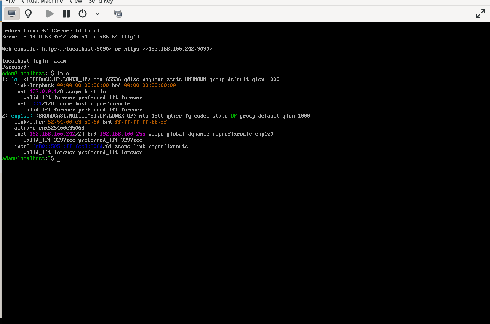

At the bottom of the left panel click `Add Hardware`

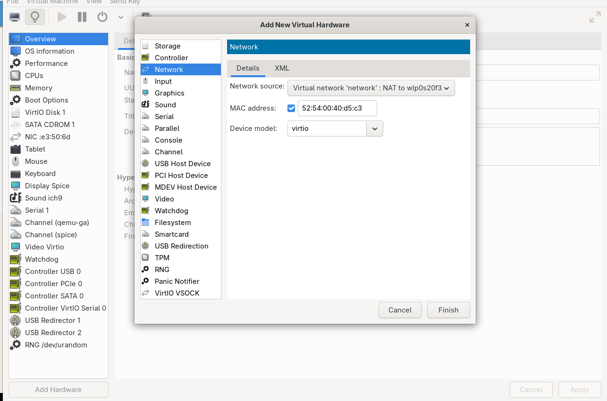

Click Network and update the Network Source to `Bridge device...` and then Device name: to `br0` (that's a zero)


```bash
adam@localhost:~$ ip a
1: lo: <LOOPBACK,UP,LOWER_UP> mtu 65536 qdisc noqueue state UNKNOWN group default qlen 1000
    link/loopback 00:00:00:00:00:00 brd 00:00:00:00:00:00
    inet 127.0.0.1/8 scope host lo
       valid_lft forever preferred_lft forever
    inet6 ::1/128 scope host noprefixroute 
       valid_lft forever preferred_lft forever
2: enp1s0: <BROADCAST,MULTICAST,UP,LOWER_UP> mtu 1500 qdisc fq_codel state UP group default qlen 1000
    link/ether 52:54:00:47:57:f3 brd ff:ff:ff:ff:ff:ff
    inet 192.168.124.225/24 brd 192.168.124.255 scope global dynamic noprefixroute enp1s0
       valid_lft 3450sec preferred_lft 3450sec
    inet6 fe80::5054:ff:fe47:57f3/64 scope link noprefixroute 
       valid_lft forever preferred_lft forever
3: enp7s0: <BROADCAST,MULTICAST,UP,LOWER_UP> mtu 1500 qdisc fq_codel state UP group default qlen 1000
    link/ether 52:54:00:f6:2f:c4 brd ff:ff:ff:ff:ff:ff
    inet 10.13.37.174/24 brd 10.13.37.255 scope global dynamic noprefixroute enp7s0
       valid_lft 3483sec preferred_lft 3483sec
    inet6 fe80::b9aa:9b9f:e081:b705/64 scope link noprefixroute 
       valid_lft forever preferred_lft forever
adam@localhost:~$ 

```

You should see a second network (third, 0, 1, and now 2) and it should eventually resolve to an IP address of `10.13.37.XX`

When you have that, you should be able to open up terminal windows `windows` and type `terminal` and then 

```bash
ssh <your-user-name>@10.13.37.XX
```

